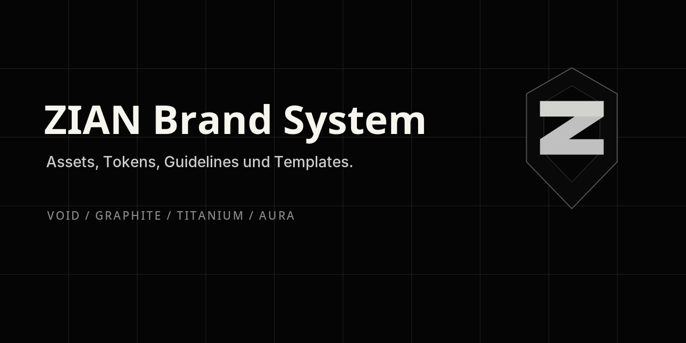

# ZIAN Brand System

Das ZIAN Brand System definiert die visuelle und strukturelle Identität von ZIAN AI Concepts.

Es enthält Assets, Design-Tokens, Typografie-Regeln, Logo-Verwendung, Layout-Prinzipien und wiederverwendbare Templates für digitale Produkte, Repositories, Präsentationen und Dokumentation.



## Core Principles

- Monolithic
- Precise
- Technical
- Modular
- Dark
- Strategic

## Inhalt

```text
assets/      Logos, Favicons, Hintergründe, Social Assets und Beispiele
docs/        Corporate-Design-Richtlinien
tokens/      Farben, CSS-Variablen, Tailwind-Preset, TypeScript-Tokens
templates/   README-, Projekt-, Case-Study- und Präsentationsvorlagen
examples/    Web-Beispiel mit ZIAN Theme
```

## Farbwelt

| Token | Hex | Verwendung |
|---|---:|---|
| Void Black | `#000000` | Haupt-Hintergrund |
| Obsidian | `#050505` | Website- und App-Basis |
| Deep Graphite | `#0A0A0A` | Cards und Module |
| Carbon Grey | `#222222` | Sekundäre Flächen |
| Silver Mist | `#CCCCCC` | Fließtext |
| Monolith White | `#F6F6EE` | Headlines |
| Aura Silver | `#E8EEE2` | Glow und Akzente |

## Typografie

- Display: Space Grotesk oder Sora
- Body: Inter oder IBM Plex Sans
- Mono: JetBrains Mono oder IBM Plex Mono

## Verwendung in Projekten

Einzelne Projekt-Repositories sollen das Brand-System referenzieren, aber nicht vollständig duplizieren.

```md
## Brand

This project follows the ZIAN Brand System.
```

## Schnellstart CSS

```css
@import "./tokens/theme.css";
```
